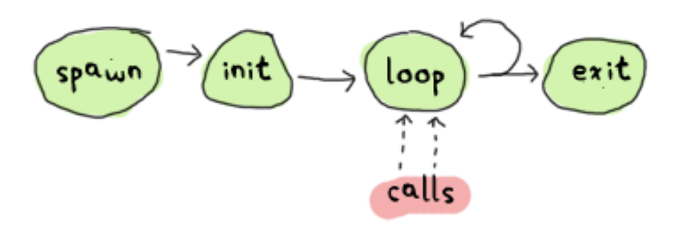
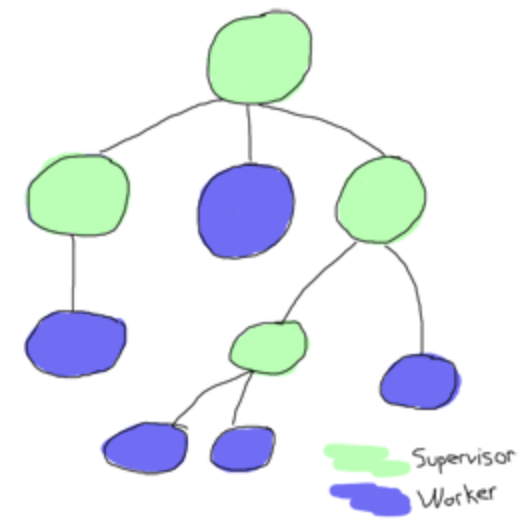
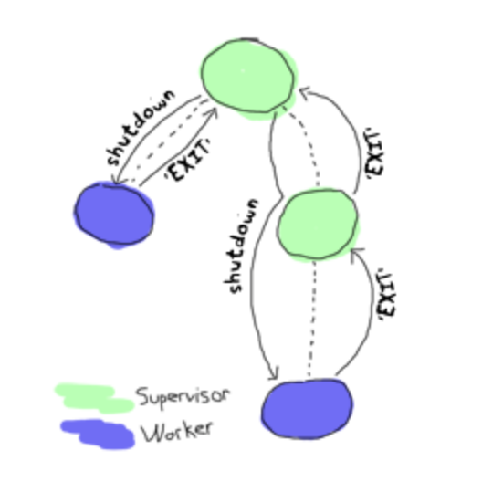

#HSLIDE

## OTP.
## GenServer, Supervisor, Application

#HSLIDE

### Преговор
Какво правихте през последния 1 месец?

#HSLIDE

### Open Telecom Platform
* Какво НЕ е OTP <!-- .element: class="fragment" -->
* Kакво е OTP <!-- .element: class="fragment" -->

#HSLIDE

### Какво НЕ е OTP
* OTP не се използва само за писане на телеком програми <!-- .element: class="fragment" -->
* OTP вече не е нещо отделно от Erlang. Дистрибуцията се нарича Erlang/OTP, а не Erlang + sometimes OTP. <!-- .element: class="fragment" -->
* Github организацията се нарича erlang, а репото - otp  <!-- .element: class="fragment" -->
* OTP не е само стандартната библиотека на Erlang <!-- .element: class="fragment" -->

#HSLIDE
### Какво е OTP
* Създаден около 1996г.
* Интерпретатор и компилатор на Erlang <!-- .element: class="fragment" -->
* Стандартните библиотеки на Erlang <!-- .element: class="fragment" -->
* Dialyzer, за който говорихме в Тип-спецификации и поведения <!-- .element: class="fragment" -->
* Mnesia - дистрибутирана база данни <!-- .element: class="fragment" -->
* ETS - база данни в паметта <!-- .element: class="fragment" -->
* Дебъгер <!-- .element: class="fragment" -->
* И много други… <!-- .element: class="fragment" -->

#HSLIDE
<!-- .slide: style="text-align: left;"> -->
В книгата **Designing for Scalability with Erlang/OTP** авторите *Francesco Cesarini* и *Steve Vinoski* дефинират OTP като три ключови компонента, които взаимодействат помежду си:

1. Самият Erlang
2. Множество от библиотеки и виртуалната машина
3. Множество от **system design principles** (принципи за дизайн на системи <sub><span style="color: #e0ebeb">некадърен превод на автора</span></sub>)

#HSLIDE
### OTP Compliant Proccess
<!-- .slide: style="text-align: left;"> -->
След OTP лекциите е силно препоръчително да спрете да спрете създавате процеси чрез **spawn**. Също така всички ваши процеси трябва да са OTP съвместими. Това ще им позволява:
1. Да бъдат използвани в супервайзор дърво
2. Грешките в тези процеси да бъдат записвани с повече детайли

#HSLIDE
<!-- .slide: style="text-align: left;"> -->
Но няма често да ви се налага ръчно да имплементирате OTP-compliant частта.

Erlang/OTP идва с абстракции, които имплементират OTP-съвместими процеси.

#HSLIDE
<!-- .slide: style="text-align: left;"> -->
Поведения, които ще разгледаме в курса
* GenServer
* Supervisor
* Application
* <s>GenEvent</s> Supervisor + GenServer (Ако остане време)
* GenStage (с Никола)

#HSLIDE
## Welcome the GenServer


#HSLIDE
## Demo + [link](http://learnyousomeerlang.com/what-is-otp#its-the-open-telecom-platform)

#HSLIDE

#HSLIDE
<!-- .slide: style="text-align: left;"> -->
##### GenServer има 6 callbacks, които имплементираме
("отклици" - патриотичен превод, [източник](https://dev.bg/javascript-%D0%BD%D0%B5%D0%BD%D1%83%D0%B6%D0%BD%D0%B8%D1%82%D0%B5-%D1%87%D0%B0%D1%81%D1%82%D0%B8/?utm_source=fb_post_astea_js_april12))
* init/1
* handle_call/3
* handle_cast/2
* handle_info/2
* terminate/2
* code_change/3
* <s>start_link/N</s> (не е callback)
#HSLIDE
#### init/1
<!-- .slide: style="text-align: left;"> -->
Инициализира началното състояние и извършва всички one-time задачи, от които зависи. Трябва да върне:
* {:ok, state}
* {:ok, state, timeout}
* {:ok, state, :hibernate}
* {:stop, reason}
* :ignore

NOTE: Докато `init/1` се изпълнява, процесът, който създава GenServer-а блокира.

#HSLIDE
#### handle_call/3
<!-- .slide: style="text-align: left;"> -->
Синхронно обработва съобщение. Трябва да върне:
* {:reply, reply, new_state}
* {:reply, reply, new_state, timeout}
* {:reply, Reply, new_state, :hibernate}
* {:noreply, new_state} <- !!!
* {:noreply, new_state, timeout} <- !!!
* {:noreply, new_state, :hibernate} <- !!!
* {:stop, reason, reply, new_state}
* {:stop, reason, new_state}

#HSLIDE
#### handle_cast/2
<!-- .slide: style="text-align: left;"> -->
Асинхронно обработва съобщение. Трябва да върне:
* {:noreply, new_state}
* {:noreply, new_state, timeout}
* {:noreply, new_state, :hibernate}
* {:stop, Reason, new_state}

#HSLIDE
#### handle_info/2
<!-- .slide: style="text-align: left;"> -->
Прилича на `handle_cast`, но обработва всички останали съобщения, изпратени чрез `send`, както и `init/1` `timeout`. Трябва да върне:
* {:noreply, new_state}
* {:noreply, new_state, timeout}
* {:noreply, new_state, :hibernate}
* {:stop, Reason, new_state}

#HSLIDE
<!-- .slide: style="text-align: left;"> -->
#### terminate/2 (1)
<!-- .slide: style="text-align: left;"> -->
Получава два аргумента - `reason` и `state` и е отговорен за терминирането на процеса. Това може да включва освобождаване на ресурси, правилно затваряне на други такива и т.н.

Note: На някои места препоръчват в `terminate` да записвате състоянието на persistant data storage, за да може да го възстановите. В огромна част от случаите това не е добро решение.
Трябва да върне:

#HSLIDE
<!-- .slide: style="text-align: left;"> -->
#### terminate/2 (2)
terminate/2 се извиква в следните случаи:
* Върнат е :stop tuple
* Вдигната е грешка (raise)
* Извикан е `Kernel.exit/1`
* Върната е невалидна стойност
* `GenServer` има `trap_exit=true` флаг и родителят му е изпратил `exit` сигнал

#HSLIDE
<!-- .slide: style="text-align: left;"> -->
#### terminate/2 (3)
terminate/2 не се извиква, ако `GenServer` бъде бъде брутално убит (`:brutal_kill`, но за това по-късно)
#HSLIDE
```elixir
{:ok, pid} = KittyServer.start_link()
:sys.trace(pid, true)
:sys.get_state(pid)
:sys.get_status(pid)
```

#HSLIDE
### Repeating job
```elixir
defmodule RepeatingJob do
  use GenServer
  def start_link() do
    GenServer.start_link(__MODULE__, %{})
  end

  def init(state) do
    schedule_work()
    {:ok, state}
  end

  def handle_info(:work, state) do
    IO.puts("HI")
    schedule_work()
    {:noreply, state}
  end

  defp schedule_work() do
    Process.send_after(self(), :work, 1_000)
  end
end
```

#HSLIDE
<!-- .slide: style="text-align: left;"> -->
Ами ако искаме да изпратим съобщение, което да се обработи с `handle_cast/2`?
```elixir
  Process.send_after(self(), {:"$gen_cast", :work}, 1_000)
```

Еквивалентно за `handle_call/3` имаме:
```elixir
  Process.send_after(self(), {:"$gen_call", :work}, 1_000)
```

#HSLIDE
<!-- .slide: style="text-align: left;"> -->
Нека да разгледаме един по-прост пример за GenServer, който конвертира стрингове към числа.
```elixir
defmodule StringToInt do
  use GenServer

  def start_link() do
    GenServer.start_link(__MODULE__, :ok, nil)
  end

  def handle_call(string, _from, state) do
    result = String.to_integer(string)
    {:reply, result, state}
  end
end
```

#HSLIDE
```
iex(1)> {:ok, pid} = StringToInt.start_link()
{:ok, #PID<0.119.0>}
iex(2)> Process.alive?(pid)
true
iex(3)> GenServer.call(pid, "100")
100
iex(4)> GenServer.call(pid, "100s")
** (EXIT from #PID<0.117.0>) shell process exited with reason: an exception was raised:
    ** (ArgumentError) argument error
        :erlang.binary_to_integer("100s")
        (string_to_int) lib/string_to_int.ex:9: StringToInt.handle_call/3
        (stdlib) gen_server.erl:636: :gen_server.try_handle_call/4
        (stdlib) gen_server.erl:665: :gen_server.handle_msg/6
        (stdlib) proc_lib.erl:247: :proc_lib.init_p_do_apply/3
```

#HSLIDE


#HSLIDE

#### Genius Idea!
```elixir
def handle_call(string, _from, state) do
  try do
    result = String.to_integer(string)
    {:reply, result, state}
  rescue
    error -> {:reply, "Cannot convert #{string} to integer. Reason: #{inspect(error)}", state}
  end
end
```

#HSLIDE
```
iex(1)> {:ok, pid} = StringToInt.start_link
{:ok, #PID<0.119.0>}
iex(2)> GenServer.call(pid, "100")
100
iex(3)> GenServer.call(pid, "100s")
"Cannot convert 100s to integer. Reason: %ArgumentError{message: \"argument error\"}"
iex(4)> GenServer.call(pid, "100")
100
```

#HSLIDE
You


#HSLIDE
Elixir Course Team


#HSLIDE
## Welcome the Supervisor


#HSLIDE
<!-- .slide: style="text-align: left;"> -->
## Supervisor Tree
Базова концепция в Erlang/OTP е супервайзор дървото. Това е модел за структуриране на процесите, базиран на идеята за работници (workers) и супервайзори (supervisors).

`worker` е всеки процес, който не е `supervisor`.

#HSLIDE


#HSLIDE

Let it crash is not what you think it is!
...и какво общо има с ракетите?

#HSLIDE
Bohrbug vs Heisenbug

#HSLIDE
Concurrency bugs are notorious for disappearing when using a debugger that may force every operation in the system to be serialised.


#HSLIDE
<!-- .slide: style="text-align: left;"> -->
*The whole language is built with the purpose of taking crashes and failures, and making them so manageable it becomes possible to use them as a tool.*

#HSLIDE
<!-- .slide: style="text-align: left;"> -->
## Supervisor
* `Supervisor` e `GenServer`
* `Supervisor` е главна част от `fault tolerance` частта
* `Supervisor` определя как ще се стартира и спира нашата програма

#HSLIDE


#HSLIDE
#### Това (proper shutdown) с какво е полезно за Task.Supervisor?

#HSLIDE
## Supervisor
* `Supervisor` е процес, който стартира други процеси, които наричаме негови деца (children)
* `Supervisor` e процес, който наблюдава своите деца и предприема действия, когато те се терминират.

#HSLIDE
#### Но нека първо да видим един пример
## Demo `StringToInt`

#HSLIDE
За да стартираме един процес в супервайзор дърво, то той трябва да дефинира функция `child_spec/1`, която връща структура с 5(6) елемента:

#HSLIDE
* `:id` - Уникална стойност, която идентифицира детето. По подразбиране е равна на __MODULE__
#HSLIDE
* `:start` - Кортеж с модул, функция и аргументи, използвани за стартиране.
#HSLIDE
* `:restart` - Атом, който дефинира кога даденият процес трябва да бъде рестартиран.
#HSLIDE
* `:shutdown` - Атом, който дефинира как процесът трябва да бъде терминиран
#HSLIDE
* `:type` - `:worker` или `:supervisor`
#HSLIDE
Съществува шести ключ `:modules`, който автоматично се инициализира от стойността на `:start` и рядко го променяме.
#HSLIDE
`:id` и `:start` са задължителни

#HSLIDE
#### `:shutdown` стойности:
* `:brutal_kill`
* Н - число > 0 - време в милисекунди, което ще се изчака след като на процесът бъде изпратен `:shutdown` сигнал.
* `:infinity` - работи като таймаут, но е равен на безкрайност.


#HSLIDE
<!-- .slide: style="text-align: left;"> -->
`use Genserver` също така дефинира функцията `child_spec/1`, която позволява модулът да бъде стартиран в супервайзор дърво.
```elixir
def child_spec(arg) do
  default = %{
    id: __MODULE__,
    start: {__MODULE__, :start_link, [arg]}
  }
  Supervisor.child_spec(default, unquote(Macro.escape(opts)))
end
```

#HSLIDE

* Как решава дали да рестартира даден процес?
* Само терминираният процес ли ще бъде рестартиран?
* Може ли смъртта на един процес да повлияе на други?
* Безкрайно ли ще рестартира терминираните процеси?
* Какво прави, ако процесът постоянно умира?
* Защо трябва да имаме йерархична структура, а не всичко да е под един супервайзор?

#HSLIDE
<!-- .slide: style="text-align: left;"> -->
Решениието дали да се рестартира даден процес зависи от `:restart` опцията. По подразбиране тя е `:permanent`. Имаме:
* `:permanent` - процесът винаги се рестартира
* `:temporary` - процесът никога не се рестартира
* `:transient` - процесът се рестартира само, ако не завърши нормално, т.е. с причина, различна от `:normal`, `:shutdown` или `{:shutdown, term}`
#HSLIDE
#### Стратегии
<!-- .slide: style="text-align: left;"> -->
Стратегията определя дали и кои процеси да бъдат рестартирани заедно с терминирания.
* `:one_for_one`
* `:rest_for_one`
* `:one_for_all`
* <s>`:simple_one_for_one`</s>

#HSLIDE
<!-- .slide: style="text-align: left;"> -->
`:max_restarts` и `:max_seconds`.

*`:max_restarts` е максималният разрешен брой рестартирания на процес за определен интервал от време.
*`:max_seconds` е интервалът в секунди, за който `:max_seconds` важи

#HSLIDE
Стартиране на Supervisor
* Стартира се чрез `Supervisor.start_link/2`
* Depth-first стартиране на всички деца в реда на инициализиране

#HSLIDE
Терминиране на Supervisor
* Всички деца се спират в обратен на стартирането им ред
* Терминирането на децата се случва чрез `Process.exit(child_pid, :shutdown)` и чака по подразбиране 5 секунди
* В случай, че за 5 секуни не получи отговор, супервайзорът терминира детето със сигнал `:brutal_kill`
* `trap_exit` does matter
#HSLIDE
Module-based Supervisor
[линк](https://hexdocs.pm/elixir/Supervisor.html#module-module-based-supervisors)
#HSLIDE
```elixir
defmodule MyApp.Supervisor do
  # Automatically defines child_spec/1
  use Supervisor

  def start_link(arg) do
    Supervisor.start_link(__MODULE__, arg, name: __MODULE__)
  end

  def init(_arg) do
    children = [
      {Stack, [:hello]}
    ]

    Supervisor.init(children, strategy: :one_for_one)
  end
end
```
#HSLIDE
<!-- .slide: style="text-align: left;"> -->
## <s>GenEvent</s> Supervisor + GenServer

`GenEvent` имплементира функционалност за обработка на събития.
Добавяме `handler`-и чрез `add_handler/3` или `add_sup_handler/3` и изпращаме събития чрез `notify/2`

`GenEvent` e `deprecated` в Elixir.

Хубаво упражнение върху `Supervisor` и `GenServer` е имплементацията на `GenEvent` - [линк](https://www.google.bg/url?sa=t&rct=j&q=&esrc=s&source=web&cd=1&ved=0ahUKEwj06Nbtk7zaAhVjOpoKHdQYDVUQFggnMAA&url=http%3A%2F%2Fblog.plataformatec.com.br%2F2016%2F11%2Freplacing-genevent-by-a-supervisor-genserver%2F&usg=AOvVaw3HO1YcKGV9WOZ1PjoZ_Muk)

#HSLIDE
## Application

#HSLIDE
Компонент, който имплементира специфична логика, която му позволява да бъде стартиран, спиран и преизползван в други application-ни.
#HSLIDE
Application се грижи за едно `supervision` дърво и средата в която то работи.

#HSLIDE
А кой се грижи за Application?

#HSLIDE


#HSLIDE
## 2 callbacks:
* start/2
* stop/1

#HSLIDE
## start/2
* стартира top-level supervisor
* Връща:
  * {:ok, pid}
  * {:ok, pid, state}
  * {:error, reason}

state по подразбиране е `[]`
#HSLIDE
## stop/1
* Изпълнява се при спиране
* Приема аргумент `state` върнат от `start/2`

#HSLIDE

#HSLIDE

